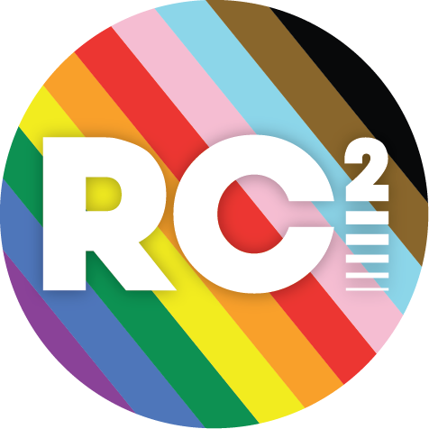
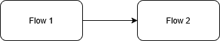

<h2 >Wiki Import Test Title</h2>

This page will serve to test the capability of importing pages from the wiki to the mkdocs website.

<h3 >Tests</h3>
<h4 >Formatting</h4>

<strong>Bold Text</strong>

<em>Italic Text</em>

Underlined

Red Text

Highlighted Text

<s>Strikethrough Text</s>

SuperScript

SubScript

Left Aligned

Center Aligned

Right Aligned

<h4  class="align-left">Lists</h4>
<ul >
<li class="null">Bullet 1</li>
<li class="null">Bullet 2
<ul>
<li class="null">Bullet 3
<ul>
<li class="null">Bullet 4</li>
</ul>
</li>
</ul>
</li>
</ul>
<ol >
<li class="null">Number 1</li>
<li class="null">Number 2</li>
<li class="null">Number 3
<ol>
<li class="null">Number 4</li>
</ol>
</li>
</ol>
<ul  style="list-style-type: tasklist;">
<li class="task-list-item"><input checked disabled type="checkbox">Checked 1</li>
<li class="task-list-item"><input checked disabled type="checkbox">Checked 2</li>
<li class="task-list-item"><input disabled type="checkbox">Unchecked 3</li>
</ul>

<h4 >Link</h4>

<a href="https://google.com">Google</a>

<h4 >Table</h4>
<table  style="border-collapse: collapse; width: 100%;" border="1"><colgroup><col style="width: 33.3333%;"><col style="width: 33.3333%;"><col style="width: 33.3333%;"></colgroup>
<thead>
<tr>
<td>Column1</td>
<td>Column 2</td>
<td>Column 3</td>
</tr>
</thead>
<tbody>
<tr>
<td>Row 1</td>
<td>Row 1</td>
<td>Row 1</td>
</tr>
<tr>
<td>Row 2</td>
<td>Row 2</td>
<td>Row 2</td>
</tr>
<tr>
<td>Row 3</td>
<td>Row 3</td>
<td>Row 3</td>
</tr>
<tr>
<td>Row 4</td>
<td>Row 4</td>
<td>Row 4</td>
</tr>
</tbody>
</table>
<h4 >Image</h4>

<h4 >Code Block</h4>
<pre ><code class="language-python">print ("Hello World!")</code></pre>
<h4 >Drawing</h4>

<h4 >Collapsible Block</h4>

Hidden items

Hidden item 1

Hidden item 2

Hidden item 3

 

 
